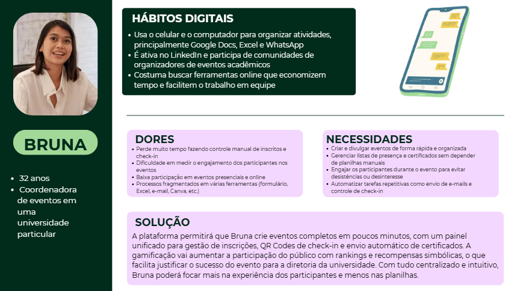

# Web Application Document - Projeto Individual - Módulo 2 - Inteli
## Nome do Projeto

Projeto Individual de Nicole Zanin Silva - Checkly.

## Sumário

1. [Introdução](#c1)  
2. [Visão Geral da Aplicação Web](#c2)  
3. [Projeto Técnico da Aplicação Web](#c3)  
4. [Desenvolvimento da Aplicação Web](#c4)  
5. [Referências](#c5)  

 

## 1. Introdução (Semana 01)

O Checkly é uma plataforma web para criação e gerenciamento de eventos que inova ao incorporar elementos de gamificação para os participantes. O sistema permite que organizadores criem eventos, cadastrem atividades, gerenciem inscrições e acompanhem em tempo real o engajamento do público.

O participante recebe acesso a um painel personalizado com QR Code, lista de eventos disponíveis, pontuação acumulada e missões a serem cumpridas. Ao participar dos eventos, os usuários realizam check-ins escaneando seus QR Codes nos dispositivos dos monitores. A pontuação é atualizada automaticamente, promovendo uma experiência dinâmica e interativa.

O organizador pode acompanhar métricas de engajamento, exportar listas de presença e gerar certificados automáticos para os participantes que completarem determinada pontuação. Todos esses recursos estão disponíveis diretamente na plataforma, sem necessidade de aplicativos externos ou planilhas manuais.

A proposta é entregar uma solução leve, intuitiva e atrativa para eventos de pequeno, médio e grade porte, desde feiras acadêmicas até grandes congressos.

## 2. Visão Geral da Aplicação Web

### 2.1. Personas (Semana 01)

### 2.2. User Stories (Semana 01)

US01 | Como organizadora de eventos, quero ter acesso às métricas de engajamento do meu evento, para que eu possa entender os intereses dos meus clientes.

US02 | Como estudante universitário, quero algo que me engaje a ir nas palestras da minha universidade, para que eu não perca mais notas por causa do meu desinteresse.

US03 | Como participante de congressos coorporativos, quero encontrar e organizar meus eventos em um só lugar, para que eu não precise perder tempo acessando diversas plataformas de diferentes empresas para realizar minha inscrição.

**INVEST- US03**
| Critério             | Avaliação                                                                                                                                                                                                 |
| -------------------- | --------------------------------------------------------------------------------------------------------------------------------------------------------------------------------------------------------- |
| **I – Independente** |  A história pode ser desenvolvida de forma autônoma, sem depender de outras funcionalidades como gamificação ou check-in.                                                                                |
| **N – Negociável**   |  A forma como os eventos serão agregados pode ser ajustada com base no feedback do usuário e nas limitações técnicas iniciais. |
| **V – Valiosa**      |  Oferece alto valor ao usuário final ao centralizar inscrições e facilitar a organização pessoal, economizando tempo e aumentando o engajamento.                                                         |
| **E – Estimável**    |  É possível estimar o esforço para implementar funcionalidades como painel de eventos salvos, área pessoal e integração com base de dados de eventos.                                                    |
| **S – Pequena**      | Será classificado em áreas menores. Como, por exemplo, uma área de eventos favoritos e separação por temas.                      |
| **T – Testável**     |  Pode ser testada verificando se o usuário consegue ver, organizar e acessar seus eventos a partir de um único local da plataforma.                                                                      |

---

## 3. Projeto da Aplicação Web

### 3.1. Modelagem do banco de dados  (Semana 3)

*Posicione aqui os diagramas de modelos relacionais do seu banco de dados, apresentando todos os esquemas de tabelas e suas relações. Utilize texto para complementar suas explicações, se necessário.*

*Posicione também o modelo físico com o Schema do BD (arquivo .sql)*

### 3.1.1 BD e Models (Semana 5)
*Descreva aqui os Models implementados no sistema web*

### 3.2. Arquitetura (Semana 5)

*Posicione aqui o diagrama de arquitetura da sua solução de aplicação web. Atualize sempre que necessário.*

**Instruções para criação do diagrama de arquitetura**  
- **Model**: A camada que lida com a lógica de negócios e interage com o banco de dados.
- **View**: A camada responsável pela interface de usuário.
- **Controller**: A camada que recebe as requisições, processa as ações e atualiza o modelo e a visualização.
  
*Adicione as setas e explicações sobre como os dados fluem entre o Model, Controller e View.*

### 3.3. Wireframes (Semana 03)

*Posicione aqui as imagens do wireframe construído para sua solução e, opcionalmente, o link para acesso (mantenha o link sempre público para visualização).*

### 3.4. Guia de estilos (Semana 05)

*Descreva aqui orientações gerais para o leitor sobre como utilizar os componentes do guia de estilos de sua solução.*

### 3.5. Protótipo de alta fidelidade (Semana 05)

*Posicione aqui algumas imagens demonstrativas de seu protótipo de alta fidelidade e o link para acesso ao protótipo completo (mantenha o link sempre público para visualização).*

### 3.6. WebAPI e endpoints (Semana 05)

*Utilize um link para outra página de documentação contendo a descrição completa de cada endpoint. Ou descreva aqui cada endpoint criado para seu sistema.*  

### 3.7 Interface e Navegação (Semana 07)

*Descreva e ilustre aqui o desenvolvimento do frontend do sistema web, explicando brevemente o que foi entregue em termos de código e sistema. Utilize prints de tela para ilustrar.*

---

## 4. Desenvolvimento da Aplicação Web (Semana 8)

### 4.1 Demonstração do Sistema Web (Semana 8)

*VIDEO: Insira o link do vídeo demonstrativo nesta seção*
*Descreva e ilustre aqui o desenvolvimento do sistema web completo, explicando brevemente o que foi entregue em termos de código e sistema. Utilize prints de tela para ilustrar.*

### 4.2 Conclusões e Trabalhos Futuros (Semana 8)

*Indique pontos fortes e pontos a melhorar de maneira geral.*
*Relacione também quaisquer outras ideias que você tenha para melhorias futuras.*

## 5. Referências

_Incluir as principais referências de seu projeto, para que seu parceiro possa consultar caso ele se interessar em aprofundar. Um exemplo de referência de livro e de site:_ 

---
---